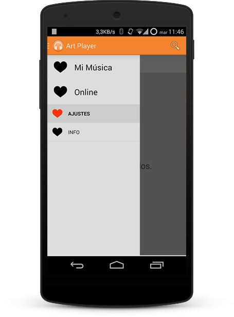

# GoogleNavigationDrawerMenu

This project aims to let you use a ListView menu similar to the one in the new Google Apps (Keep, Play Music...) without having to do any extra effort. Sorry for the long name, though.



## Features

With GoogleNavigationDrawerMenu you can:

  * Set a GoogleApp-styled DrawerLayout menu and only have to specify the main content for your app, you no longer have set the ListView and its styles. Everything is handler by the **GoogleNavigationDrawer** class.
  * Set main and secondary sections to the menu.
  * Set a list of icons for those sections (optional).
  * Both text and icons remain selected when you click on them.
  * Set an *OnSectionSelectedListener* so you can handle section selection events.
  * Change the background of the list items.
  * Set a header and footer to the inner ListView.

## How to use

###1. Include the library:

  **Manually (Option A):**

  Download the source code and import ```GoogleNavigationDrawerMenu``` folder as a Library Module in Android Studio or as a Project in Eclipse (still not tested).


  **Manually (Option B):**

  * Download the AAR.
  * Put it in the ```aars``` folder of your Android Studio project.
  * Add a File Dependency or add it to the ```build.gradle``` of your main Module, like this:

        repositories {
          mavenCentral()
          flatDir {
              dirs 'aars'
          }
        }

  Notice the ```flatDir``` local maven repository created. It will load any .aar file found in that directory.

**Maven dependency:**

I'm sorry, but it still isn't available as a Maven dependency.

###2. Use class in XML or code:

####Example of how to use it on an XML code:

    <org.arasthel.googlenavdrawermenu.views.GoogleNavigationDrawer
    xmlns:android="http://schemas.android.com/apk/res/android"
    xmlns:app="http://schemas.android.com/apk/res-auto"
    android:id="@+id/navigation_drawer_container"
    android:layout_width="match_parent"
    android:layout_height="match_parent"
    app:list_paddingTop="?android:actionBarSize"
    app:drawer_gravity="start"
    app:list_mainSectionsEntries="@array/navigation_main_sections"
    app:list_secondarySectionsEntries="@array/navigation_secondary_sections"
    app:list_mainSectionsDrawables="@array/drawable_ids"
    app:list_secondarySectionsDrawables="@array/drawable_ids">

      <FrameLayout
          android:id="@+id/content_layout"
          android:layout_width="match_parent"
          android:layout_height="match_parent"/>

    </org.arasthel.googlenavdrawermenu.views.GoogleNavigationDrawer>

You may think *'Ok, so where's the menu?'*. Well, the GoogleNavigationDrawer class itself contains it and handles it so you don't have to manually modify it. You can customize it, though, you can find that info in **Section 4**.

All the ```app:*``` attributes are optional, but if you don't provide any entries you will have to do it later in code with ```drawer.setListViewSections(...)```.

####Using GoogleNavigationDrawer in Java Code:

    GoogleNavigationDrawer drawer = new GoogleNavigationDrawer(context);
    // Here we are providing data to the adapter of the ListView
    drawer.setListViewSections(new String[]{"Section A", "Section B"}, // Main sections
            new String[]{"Settings"}, // Secondary sections
            new int[]{R.drawable.ic_launcher}, // Main sections icon ids
            null); // Secondary sections icon ids
    this.addView(drawer);

GoogleNavigationDrawer extends DrawerLayout. This means you can use DrawerLayout methods and set a DrawerListener to it.

###3. Handling selection, opening and closing of the menu:

 As you cannot access the inner ListView to ensure encapsulation, additional methods have been provided so you can do it by code. This methods are:

     public boolean isDrawerMenuOpen();

     public void openDrawerMenu();

     public void closeDrawerMenu();

Also, to handle section selections, a listener has been provided:

    public void setOnNavigationSectionSelected(OnNavigationSectionSelected listener);


###4. Customizing the inner ListView:

 Finally, customization. The main XML attributes of the class are the following:

    app:list_padding[Top, Bottom, Left, Right]="dimen"
    app:drawer_gravity="start"
    app:list_mainSectionsEntries="array"
    app:list_secondarySectionsEntries="array"
    app:list_mainSectionsDrawables="array"
    app:list_secondarySectionsDrawables="array"
    app:list_headerView="layout"
    app:list_footerView="layout"
    app:list_mainSectionsBackground="drawable"
    app:list_secondarySectionsBackground="drawable"


Example of *arrays* in ```arrays.xml```:

    <?xml version="1.0" encoding="utf-8"?>
    <resources>

        <string-array name="navigation_main_sections">
            <item>Home</item>
            <item>Some Other</item>
        </string-array>

        <string-array name="navigation_secondary_sections">
            <item>Settings</item>
            <item>Info</item>
        </string-array>

        <array name="drawable_ids">
            <item>@drawable/ic_home</item>
            <item>@drawable/ic_other</item>
        </array>

    </resources>

Also, both icon drawables and backgrounds **should have checked states** to keep them consistent with the rest of the library:

    <?xml version="1.0" encoding="utf-8"?>

    <selector xmlns:android="http://schemas.android.com/apk/res/android">
        <item android:state_checked="true" android:drawable="@drawable/ic_on"></item>
        <item android:drawable="@drawable/ic_off"></item>
    </selector>

All these attributes can also be set by code.

## License:

This library is licensed under GPLv3:

>GoogleNavigationDrawerMenu - Copyright (C) 2014, Jorge Martín (Arasthel)
>This program is free software: you can redistribute it and/or modify it under the terms of the GNU General Public License as published by the Free Software Foundation, either version 3 of the License, or (at your option) any later version.

>This program is distributed in the hope that it will be useful, but WITHOUT ANY WARRANTY; without even the implied warranty of MERCHANTABILITY or FITNESS FOR A PARTICULAR PURPOSE. See the GNU General Public License for more details.

>You should have received a copy of the GNU General Public License along with this program. If not, see <http://www.gnu.org/licenses/>.

This means you can use the library in whatever way you want and also I take no responsibility of what it could do (thermo-nuclear explosions and such).

Anyway, it would be really nice of you if you could give this library a line in some "About" section in your app.
